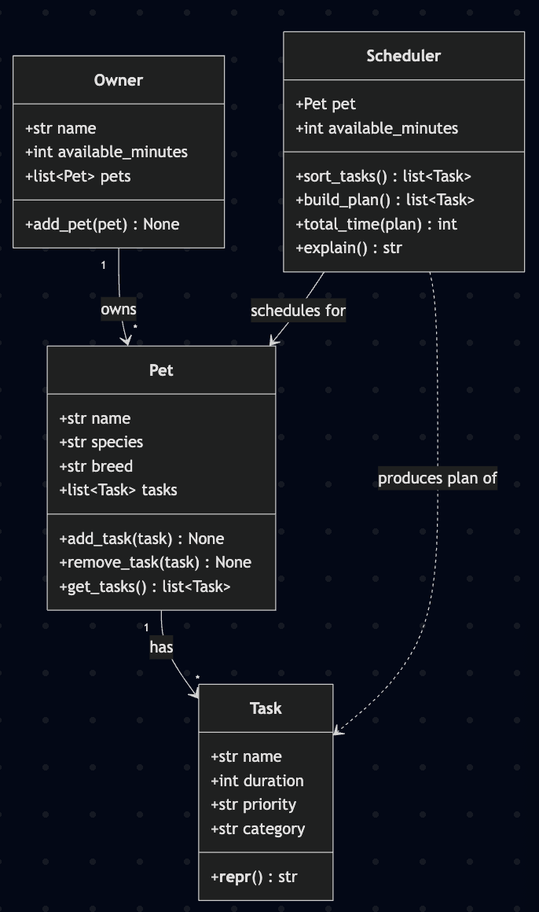
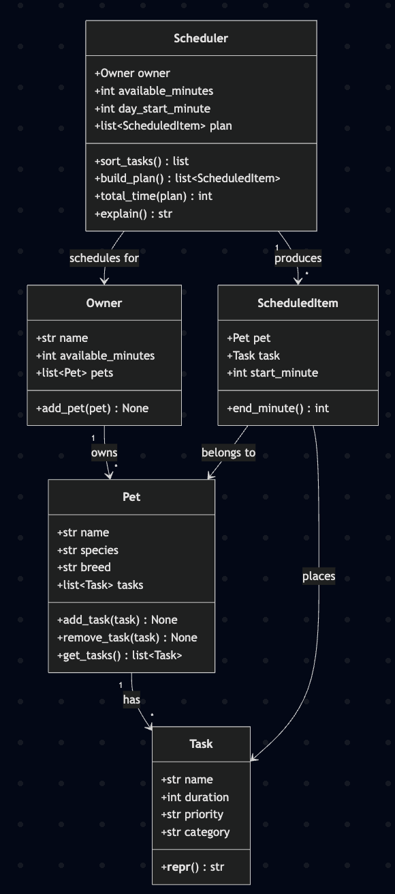

# PawPal+ Project Reflection

## 1. System Design

**a. Initial design**


- Briefly describe your initial UML design.

    Three core actions a user should be able to perform:

    1. Let user enter basic owner and pet information.
    2. Let a user add/edit tasks and their durations and priorities.
    3. Generate schedule based on durations and priorities.

    Main objects needed for the system (attributes and methods for each are listed in the following bullet point): 

    1. Owner
    2. Pet
    3. Task
    4. Scheduler

- What classes did you include, and what responsibilities did you assign to each?

    The following is the initial UML design:

    

**b. Design changes**

- Did your design change during implementation?

    Yes.
- If yes, describe at least one change and why you made it.

    One thing that was changed: The Scheduler now plans for an *Owner* rather than a single Pet (what the original version does), so an owner
    with several pets can share one daily time budget.

    This is the new UML:
    

---

## 1-2. Sample Output

The terminal output from running `main.py`:

```
Today's Schedule
========================================
Plan for Harvey (75 of 180 min used):
  07:00-07:15  Breakfast (Rex, high priority, 15 min)
  07:15-07:45  Morning walk (Rex, high priority, 30 min)
  07:45-07:55  Litter cleanup (Milo, medium priority, 10 min)
  07:55-08:15  Play time (Milo, low priority, 20 min)
Tasks are chosen highest-priority first, shortest-first to break ties; this fills the budget greedily rather than searching for the optimal mix.
```

---

## 2. Scheduling Logic and Tradeoffs

**a. Constraints and priorities**

- What constraints does your scheduler consider (for example: time, priority, preferences)?
- How did you decide which constraints mattered most?

**b. Tradeoffs**

- Describe one tradeoff your scheduler makes.

    **Conflict detection checks overlapping durations, but only for tasks the
    user explicitly pins to a `start_time`.** `Scheduler.detect_conflicts()`
    compares the full time *interval* of each pinned task
    (`start_time` … `start_time + duration`), so a 09:00 task lasting 30 min is
    correctly flagged against a 09:15 task — not just exact start-time matches.
    However, tasks *without* a `start_time` are laid out back-to-back by the
    greedy `build_plan()` and are never considered "conflicting," because by
    construction they can't overlap. So the scheduler detects clashes among
    fixed-time commitments (a vet appointment, a grooming slot) but does not try
    to resolve them — it returns a warning string rather than rearranging tasks
    or crashing.

- Why is that tradeoff reasonable for this scenario?

    A pet owner's day has a few genuinely fixed commitments and many flexible
    chores. Modeling only the fixed ones as pinned keeps the common case simple
    (the greedy planner just fills the budget) while still catching the real
    double-booking risk — one owner can't be at the vet and the groomer at once.
    Warning instead of auto-resolving keeps the owner in control: they see the
    clash and decide what to move, which is safer than the program silently
    dropping or shifting a task they cared enough about to pin.

    On the implementation side, I also traded a micro-optimization for
    readability here. My first version sorted the pinned tasks and used an early
    `break` to skip comparisons once tasks started after the current one ended
    (an O(n log n) short-circuit). I replaced it with a straightforward
    `itertools.combinations(pinned, 2)` pass: it is O(n²), but since a day has
    only a handful of pinned tasks the cost is negligible, and the pairwise
    intent reads far more clearly. I kept the sort — not for speed, but so
    warnings print in chronological order.

---

## 3. AI Collaboration

**a. How you used AI**

- How did you use AI tools during this project (for example: design brainstorming, debugging, refactoring)?
- What kinds of prompts or questions were most helpful?

**b. Judgment and verification**

- Describe one moment where you did not accept an AI suggestion as-is.
- How did you evaluate or verify what the AI suggested?

---

## 4. Testing and Verification

**a. What you tested**

- What behaviors did you test?
- Why were these tests important?

**b. Confidence**

- How confident are you that your scheduler works correctly?
- What edge cases would you test next if you had more time?

---

## 5. Reflection

**a. What went well**

- What part of this project are you most satisfied with?

**b. What you would improve**

- If you had another iteration, what would you improve or redesign?

**c. Key takeaway**

- What is one important thing you learned about designing systems or working with AI on this project?
